# TP4: Módulos de Kernel y Llamadas al Sistema

**Materia:** Sistemas de Computación

**Grupo:** Electrotonto y Computarados

**Integrantes:**

* Martina Juri
* Marcos Morán
* Francisco Gomez Neimann
* Cristian Eduardo Arteaga Barrera

**Docentes:**

* Miguel Ángel Solinas
* Javier Alejandro Jorge

---

# Introducción

En este trabajo práctico se investigó el funcionamiento de los módulos del kernel en Linux, su carga y descarga dinámica, la diferencia entre espacio de usuario y espacio del kernel, y distintas herramientas relacionadas con el análisis del sistema operativo.

Un módulo del kernel es una porción de código que puede cargarse y descargarse dinámicamente en el núcleo del sistema operativo sin necesidad de reiniciar el sistema. Esto permite extender funcionalidades del kernel de manera flexible, por ejemplo agregando drivers, soporte para hardware o sistemas de archivos.

Durante el desarrollo del trabajo se compiló y cargó un módulo propio, se analizaron los mensajes del kernel utilizando `dmesg`, se inspeccionaron módulos cargados con `lsmod`, se investigó el contenido de `/dev` y se comparó un módulo desarrollado por nosotros con módulos reales del sistema Linux.

Además, se exploraron conceptos relacionados con Secure Boot y la firma de módulos del kernel, aunque la máquina virtual utilizada para esta primera parte del trabajo no poseía soporte EFI habilitado.

---

# Preparación del entorno

Para realizar el trabajo se utilizó una máquina virtual con Ubuntu Linux. Se instalaron las herramientas necesarias para compilar módulos del kernel y trabajar con paquetes.

```bash
sudo apt update
sudo apt install build-essential checkinstall linux-headers-$(uname -r)
```

También se verificó la versión del kernel utilizada:

```bash
uname -r
```

Resultado:

```text
6.8.0-48-generic
```

---

# Compilación del módulo

Se utilizó el módulo de ejemplo provisto por la cátedra dentro del directorio `part1/module`.

El módulo fue compilado utilizando `make`:

```bash
make
```

Esto generó el archivo:

```text
mimodulo.ko
```

que corresponde al módulo compilado listo para cargarse en el kernel.

---

# Carga del módulo en el kernel

Para cargar el módulo se utilizó:

```bash
sudo insmod mimodulo.ko
```

Luego se verificaron los mensajes del kernel mediante:

```bash
sudo dmesg | tail
```

Obteniendo:

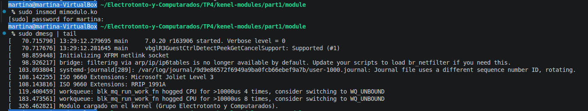

Esto indica que el módulo fue cargado correctamente y que la función de inicialización del módulo se ejecutó exitosamente.

---

# Verificación de módulos cargados

Una vez cargado el módulo, se verificó su presencia mediante `lsmod`:

```bash
lsmod | grep mimodulo
```

Resultado:

```text
mimodulo 12288 0
```

Esto indica:

* nombre del módulo
* tamaño ocupado en memoria
* cantidad de referencias activas

También se inspeccionó `/proc/modules`:

```bash
cat /proc/modules | grep mimodulo
```

Resultado:

```text
mimodulo 12280 0 - Live 0x0000000000000000 (OE)
```

El sufijo `(OE)` indica que el módulo es:

* **O:** Out-of-tree → módulo externo al árbol oficial del kernel.
* **E:** unsigned/external → módulo externo no firmado.

---

# Información del módulo utilizando modinfo

Se utilizó:

```bash
modinfo mimodulo.ko
```

Obteniendo:

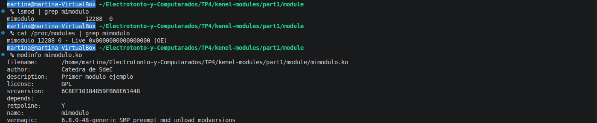

El campo `vermagic` resulta especialmente importante, ya que indica la versión del kernel con la cual el módulo fue compilado. Si el módulo se compila utilizando headers incompatibles, el kernel puede rechazar su carga.

---

# 1. Comparación con un módulo real del sistema

Se buscaron módulos disponibles dentro del sistema mediante:

```bash
find /lib/modules/$(uname -r) | grep '\.ko$' | head -20
```

Entre ellos se seleccionó el módulo:

```text
/lib/modules/6.8.0-48-generic/misc/vboxvideo.ko
```

Luego se ejecutó:

```bash
modinfo /lib/modules/6.8.0-48-generic/misc/vboxvideo.ko
```

Resultado parcial:

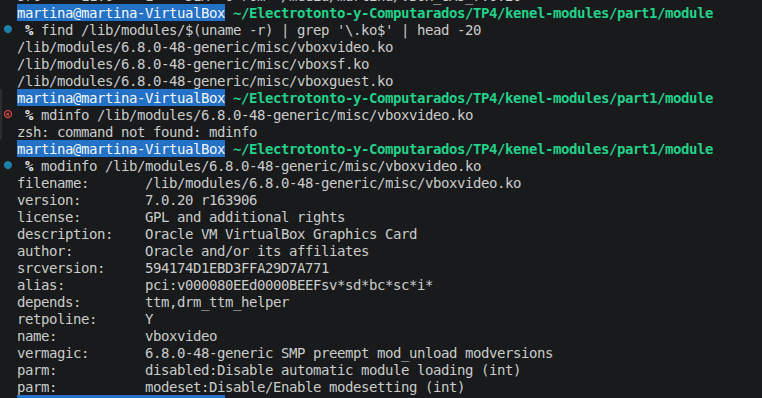

A diferencia de nuestro módulo simple, este módulo posee:

* dependencias con otros módulos
* parámetros configurables
* mayor cantidad de metadata
* funcionalidad real de driver gráfico para VirtualBox

Esto refleja la diferencia entre un módulo de ejemplo y un driver utilizado realmente por el sistema operativo.

---

## Descarga del módulo

Para descargar el módulo del kernel se utilizó:

```bash
sudo rmmod mimodulo
```

Posteriormente se revisaron nuevamente los logs del kernel:

```bash
sudo dmesg | tail
```

Durante la descarga apareció un mensaje de error del kernel acompañado por registros internos y stack trace.

Finalmente se observó:

```text
Modulo descargado del kernel.
```

Esto permitió observar cómo un error dentro de un módulo afecta directamente al kernel, ya que los módulos se ejecutan en espacio privilegiado y no poseen el aislamiento de memoria que tienen los programas normales de usuario.

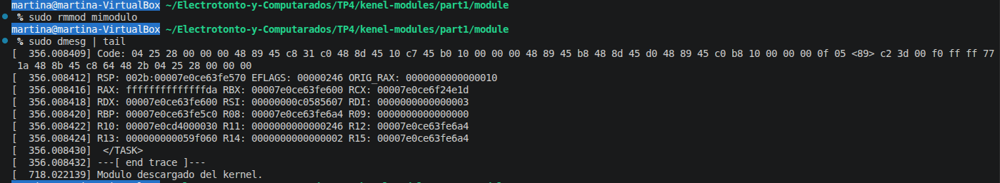

---
# 2. Diferencia en los drivers/módulos cargados en las PC del grupo

## Drivers de cada integrante
* [Drivers de Marcos](./Drivers%20de%20los%20integrantes/drivers_marcos.txt)
* [Drivers de Cristian](./Drivers%20de%20los%20integrantes/drivers_cristian.txt) 

### Metodología de comparación
Para realizar una comparación entre los módulos cargados de un usuario con  Linux de forma nativa (Marcos) y un usuario con Linux desde una VM (Cristian), se procedió a estandarizar la salida del comando `lsmod` de cada integrante. Debido a que el tamaño en memoria y el número de dependencias de un mismo módulo varían según el hardware, comparar las salidas en crudo generaría falsos positivos. 

Para solucionarlo, se utilizó una tubería de comandos en la terminal (`lsmod | awk 'NR>1 {print $1}' | sort`) con el fin de extraer únicamente la columna con los nombres de los módulos, omitir los encabezados y ordenarlos alfabéticamente. Finalmente, se utilizó la herramienta `diff -y` para poner ambos archivos lado a lado y visualizar mediante los símbolos `<` y `>` qué módulos estaban presentes en un sistema y ausentes en el otro.

### Conclusión del análisis comparativo

* [diferencias.txt](<Drivers de los integrantes/diferencias.txt>)

El resultado del comando `diff` (diferencias.txt) revela de forma muy clara el contraste arquitectónico entre un entorno virtualizado y el hardware físico de una PC real.

Por un lado, el equipo de Cristian (columna izquierda) corre sobre una máquina virtual de VMware. Esto queda en evidencia por la presencia exclusiva de módulos destinados a la virtualización, como `vmw_balloon`, `vmwgfx` (controlador de gráficos virtual) y `vmw_vmci`, los cuales son inexistentes en el sistema de Marcos.

Por otro lado, la computadora de Marcos (columna derecha) corresponde a un hardware físico. Su kernel debió cargar dinámicamente una gran cantidad de módulos para inicializar dispositivos reales y periféricos que la máquina virtual abstrae o directamente no posee. Entre las diferencias más notables a favor del equipo de Marcos encontramos:
* **Gráficos dedicados:** Carga del módulo `amdgpu`, indicando el uso de hardware gráfico de AMD.
* **Conectividad:** Presencia de múltiples módulos para red inalámbrica Wi-Fi, como `cfg80211`, `mac80211` y drivers específicos `rtw88_`, además de todo el stack de Bluetooth (`bluetooth`, `btusb`, `btintel`).
* **Multimedia y almacenamiento:** Una extensa lista de controladores de audio avanzados (`snd_soc_...`, `snd_hda_...`) , soporte para cámara web (`uvcvideo`, `videodev`) y drivers para discos NVMe (`nvme`, `nvme_core`).

Esta comparativa práctica demuestra cómo el kernel de Linux funciona de forma modular, cargando en memoria únicamente los drivers estrictamente necesarios para administrar el hardware real o virtual detectado durante el arranque del sistema operativo.

## 3. Módulos disponibles en disco vs. módulos cargados en el kernel

En Linux, existe una diferencia técnica entre los controladores que están **disponibles** y los que están **cargados**:

* **Módulos almacenados (disponibles):** El sistema operativo incluye miles de módulos (archivos con extensión `.ko` o `.ko.zst`) que vienen precompilados y guardados físicamente en el disco rígido, alojados en el directorio `/lib/modules/$(uname -r)/`. Estos archivos conforman el repertorio o "caja de herramientas" del sistema. Están disponibles para ser utilizados, pero **no** se encuentran en la memoria RAM ni están en ejecución, por lo que no consumen recursos del sistema.

* **Módulos cargados (activos):** Debido a que Linux posee un kernel dinámico, no necesita tener todos los drivers funcionando al mismo tiempo. Cuando el sistema operativo detecta la conexión de un hardware específico (por ejemplo, una placa Wi-Fi) o requiere una función particular, el kernel busca el archivo `.ko` correspondiente en el disco duro y lo **carga** dinámicamente en la memoria RAM (espacio del kernel). Solo los módulos que han sido cargados a la memoria son los que se encuentran activos gestionando el sistema, y son los únicos que aparecen listados al ejecutar el comando `lsmod`.

### Modulos no cargados en el kernel pero disponibles de cada integrante:
* [Módulos disponibles pero no cargados (Marcos)](./Modulos%20disponibles%20de%20los%20integrantes/modulos_disponibles_marcos.txt)
* [Módulos disponibles pero no cargados (Cris)](<Modulos disponibles de los integrantes/modulos_disponibles_cris.txt>)
### Que pasa cuando un driver del dispositivo no está disponible?

Cuando el driver de un dispositivo no está disponible, el sistema operativo no puede controlar correctamente ese hardware. El dispositivo puede ser detectado físicamente, pero no podrá ser utilizado o funcionará de manera limitada mediante un controlador genérico. Esto ocurre porque el driver es el componente que permite al kernel comunicarse con el dispositivo, traduciendo las operaciones del sistema en instrucciones específicas para ese hardware. En Linux, muchos drivers se cargan como módulos del kernel; si el módulo correspondiente no está disponible, no puede cargarse y el dispositivo queda sin soporte funcional.

Ej: Si falta el módulo/driver de una placa Wi-Fi, el sistema puede reconocer que hay un adaptador conectado, pero no va a crear una interfaz inalámbrica utilizable como wlan0 o wlpXsY.

# 4. Ejecución de hwinfo en hardware real

Se ejecutó `hwinfo` sobre una PC real y se guardó la salida en el siguiente archivo:

[Ver información de hardware del equipo](./hwinfo_out.txt)

# 5. Diferencia entre un programa y un módulo

## Programa de usuario

Un programa normal:

* se ejecuta en espacio de usuario
* utiliza bibliotecas como libc
* accede al hardware mediante llamadas al sistema
* posee memoria aislada y protegida

Si ocurre un error grave, normalmente solo se termina el proceso.

---

## Módulo del kernel

Un módulo:

* se ejecuta en espacio del kernel
* posee privilegios totales
* accede directamente al hardware y memoria
* utiliza funciones internas del kernel

Errores dentro de un módulo pueden provocar:

* kernel oops
* kernel panic
* congelamiento del sistema

---
# 6. Llamadas al sistema de un programa "Hello World" en C

Para observar las llamadas al sistema que realiza un programa básico en espacio de usuario ([programa](hola.c)), se compiló un código en C utilizando la función `printf` y se ejecutó a través de la herramienta de diagnóstico `strace`.

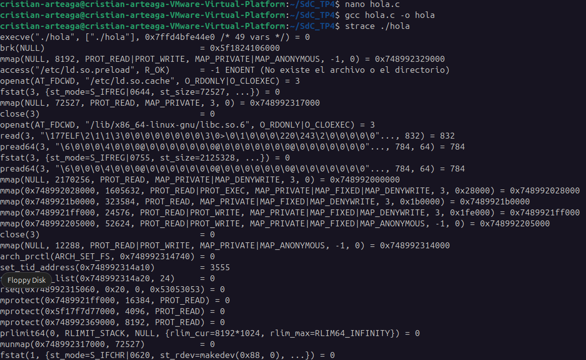
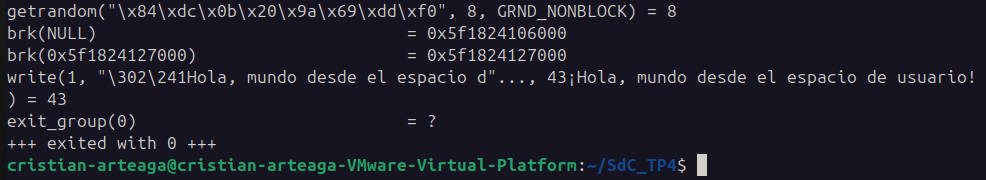

Al analizar la salida, se comprueba que un programa de usuario no puede interactuar con el hardware de forma directa. El proceso inicia con la llamada `execve` y realiza múltiples peticiones `mmap` y `openat` para cargar en memoria la biblioteca estándar de C (`libc.so.6`). 

El momento exacto en el que el programa solicita imprimir el texto en pantalla ocurre mediante la llamada al sistema fundamental:
`write(1, "¡Hola, mundo desde el espacio de usuario!\n", 43)`

En esta instrucción, el programa le envía al kernel el buffer de texto (43 bytes) apuntando al descriptor de archivo `1` (Standard Output). Finalmente, el ciclo de vida del programa concluye con la llamada `exit_group(0)`, correspondiente al `return 0` de la función principal, indicando al kernel que debe terminar el proceso y liberar los recursos.

# 7. Segmentation Fault

Un *Segmentation Fault* es un error crítico que ocurre cuando un programa en ejecución intenta acceder a una posición de la memoria RAM que no le pertenece o para la cual no tiene los permisos adecuados. Los ejemplos más comunes que causan este error incluyen:
* Intentar leer o escribir en un puntero nulo (`NULL`).
* Acceder a un índice de un arreglo que está fuera de sus límites.
* Intentar escribir datos en una sección de la memoria marcada como de "solo lectura".

### ¿Cómo lo maneja el kernel?
El kernel trabaja en conjunto con el hardware del procesador, específicamente con la Unidad de Manejo de Memoria (MMU), para aislar la memoria de cada proceso. 
1. **Detección:** Cuando un programa intenta hacer un acceso ilegal, la MMU bloquea la acción por hardware y dispara una excepción que despierta al kernel.
2. **Intervención:** El kernel toma el control de la situación para proteger la integridad del sistema operativo y la de los demás programas.
3. **Sentencia:** Al identificar al proceso culpable, el kernel le envía una señal asíncrona de terminación fatal conocida como `SIGSEGV` (Signal Segmentation Violation).

### ¿Cómo lo maneja un programa?
* **Comportamiento por defecto:** Cuando un programa de usuario recibe la señal `SIGSEGV` enviada por el kernel, se cierra abruptamente. Como mecanismo de ayuda, el sistema suele generar un archivo llamado "volcado de memoria" (*Core Dump*), que es una foto del estado de la memoria en el instante del choque, útil para que el desarrollador pueda depurar el error.
* **Manejo personalizado:** Aunque es una mala práctica intentar recuperarse de un fallo de memoria real, técnicamente un programa en C puede utilizar funciones como `signal()` o `sigaction()` para registrar un "manejador de señales" (*signal handler*). Esto le permite al programa interceptar la señal `SIGSEGV`, imprimir un mensaje de error personalizado en la consola, guardar información crítica y luego cerrarse de forma un poco más controlada.

---

# 8. Secure Boot y EFI en la máquina virtual

Se intentó verificar el estado de Secure Boot mediante:

```bash
mokutil --sb-state
```

Resultado:

```text
EFI variables are not supported on this system
```

Además se verificó:

```bash
ls /sys/firmware/efi
```

Resultado:

```text
No such file or directory
```

Esto indica que la máquina virtual utilizada estaba funcionando en modo BIOS legacy y no utilizando UEFI con soporte EFI real.

Por este motivo:

* no fue posible probar Secure Boot completamente
* no fue posible registrar claves MOK
* el kernel permitió cargar módulos sin firma digital

Aun así, se investigó teóricamente el funcionamiento de Secure Boot y la firma de módulos del kernel.

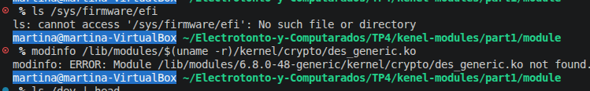

# 9. Compilación, carga y descarga de módulo propio imprimiendo nombre del equipo en los registros del kernel

#### Preparación
En esta sección se trabajó con la compilación, firma, carga y descarga de un módulo de kernel propio en **Zorin OS**, sistema basado en Ubuntu. El objetivo fue intentar firmar un módulo de kernel siguiendo como referencia el procedimiento indicado en AskUbuntu sobre el uso de la herramienta `sign-file`.

El punto de partida fue la necesidad de cargar un módulo llamado `mimodulo.ko`. Al intentar insertarlo en el kernel mediante el comando:

```bash
sudo insmod mimodulo.ko
```
El sistema devolvía el siguiente error

```bash
insmod: ERROR: could not insert module mimodulo.ko: Key was rejected by service
```
Este mensaje indica que el kernel rechazó el módulo porque no estaba firmado con una clave confiable para el sistema. Esto ocurre especialmente cuando el equipo tiene Secure Boot activado, ya que el kernel exige que los módulos cargados estén firmados digitalmente.

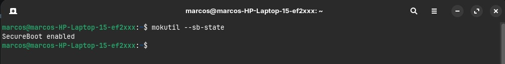
<p style="text-align: center;">Aqui se puede ver que el secure boot estaba activado haciendo uso del comando mokutil --sb-state</p>

Luego se instalaron las herramientas necesarias para trabajar con la firma de módulos:
```bash
sudo apt update
sudo apt install mokutil openssl linux-headers-$(uname -r) build-essential
```

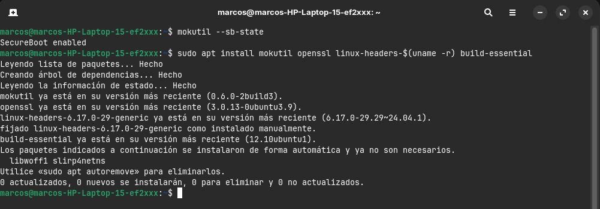

A continuación, se generó una clave privada y un certificado público utilizando OpenSSL. Para mantener los archivos ordenados, se creó una carpeta específica:

```bash
mkdir -p ~/firma-modulos-kernel
cd ~/firma-modulos-kernel
```
Dentro de esa carpeta se ejecutó el siguiente comando:
```bash
openssl req -new -x509 -newkey rsa:2048 \
  -keyout MOK.priv \
  -outform DER \
  -out MOK.der \
  -nodes \
  -days 36500 \
  -subj "/CN=Clave para firmar modulos de kernel/"
```
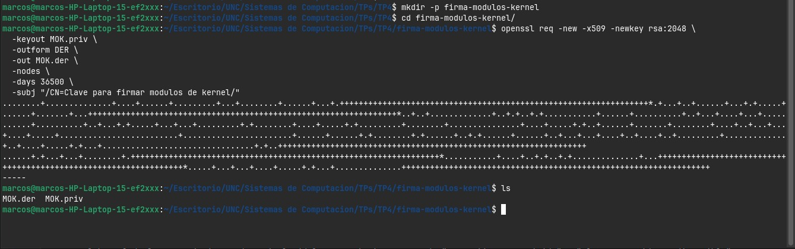

Este comando generó dos archivos principales:

+ `MOK.priv`: clave privada utilizada para firmar el módulo.
+ `MOK.der`: certificado público que debe ser registrado en el sistema.

Luego se importó el certificado público mediante `mokutil`:
```bash
sudo mokutil --import MOK.der
```
El sistema solicitó una contraseña temporal. Después de reiniciar el equipo, apareció el administrador MOK, donde se completó el enrolamiento de la clave seleccionando la opción **Enroll MOK**. Este paso fue necesario para que Secure Boot reconociera como confiable la clave utilizada para firmar el módulo.

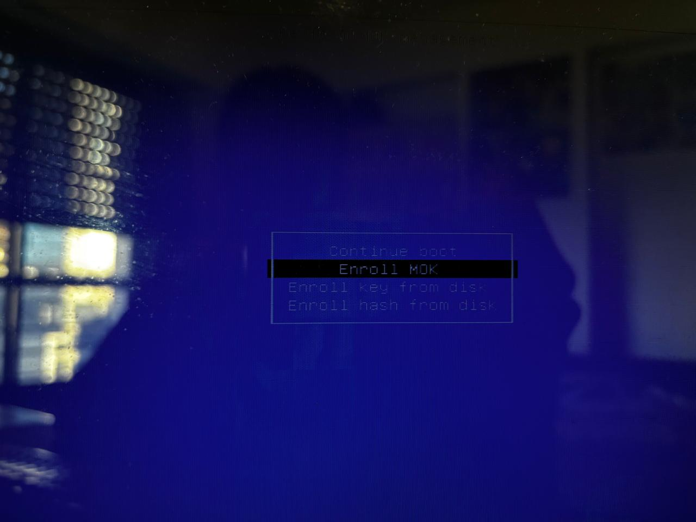

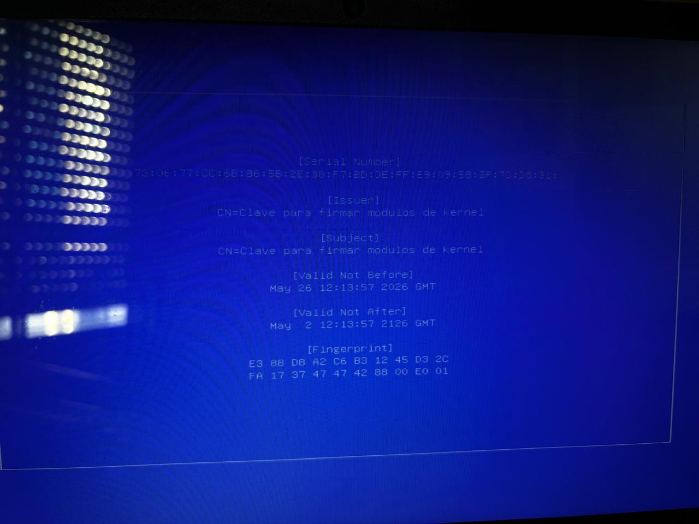
<p style="text-align: center;">Detalles de la clave pública</p>

Una vez enrolada la clave, se buscó la ubicación de la herramienta `sign-file`, que es el programa utilizado para firmar módulos de kernel. En este caso, se encontraba dentro de `/usr/src`, por lo que se verificó su ubicación con:
```bash
find /usr/src -name sign-file 2>/dev/null
```
La ruta esperada tiene una forma similar a la siguiente:
```bash
/usr/src/linux-headers-$(uname -r)/scripts/sign-file
```
Luego se firmó el módulo con el siguiente comando:
```bash
sudo /usr/src/linux-headers-$(uname -r)/scripts/sign-file sha256 MOK.priv MOK.der mimodulo.ko
```
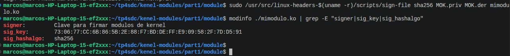
<p style="text-align: center;">Luego de firmar el módulo, se verificó la firma mediante el comando modinfo</p>

Además de firmar el módulo, se agregó evidencia de compilación, carga y descarga del módulo. Para ello, el módulo fue programado para imprimir mensajes en los registros del kernel, incluyendo el nombre del equipo. El código del módulo utiliza `utsname()->nodename` para obtener el nombre del host desde el kernel.

El archivo `mimodulo2.c` utilizado tiene la siguiente estructura:
```bash
#include <linux/init.h>
#include <linux/module.h>
#include <linux/kernel.h>
#include <linux/utsname.h>

MODULE_LICENSE("GPL");
MODULE_AUTHOR("Electrotonto y computarados");
MODULE_DESCRIPTION("Modulo de kernel firmado para TP");
MODULE_VERSION("1.0");

static int __init mimodulo_init(void)
{
    pr_info("mimodulo: modulo cargado correctamente en el equipo %s\n",
            utsname()->nodename);
    return 0;
}

static void __exit mimodulo_exit(void)
{
    pr_info("mimodulo: modulo descargado correctamente del equipo %s\n",
            utsname()->nodename);
}

module_init(mimodulo_init);
module_exit(mimodulo_exit);
```
La compilación se realizó con:
```bash
make
```
Luego de compilar y firmar el módulo, se intentó cargarlo nuevamente:
```bash
sudo insmod ./mimodulo.ko
```
Para verificar que el módulo estuviera cargado, se utilizó:
```bash
lsmod | grep mimodulo
```
Además, se revisaron los registros del kernel con:
```bash
sudo dmesg | tail -20
```
Finalmente, el módulo se descargó mediante:
```bash
sudo rmmod mimodulo
```

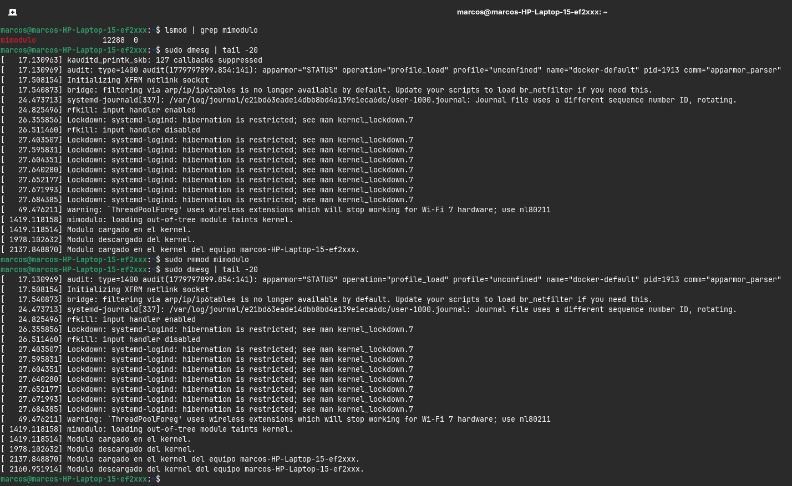
<p style="text-align: center;">Aquí se evidencia el resultado</p>

De esta manera, se pudo documentar el proceso completo: primero se detectó que el módulo era rechazado por no estar firmado, luego se generó una clave MOK, se registró esa clave en el sistema, se firmó el módulo con `sign-file`, se verificó la firma con `modinfo`, se cargó el módulo con `insmod`, se verificó su carga con `lsmod` y se comprobó su funcionamiento mediante los mensajes impresos en `dmesg`. Finalmente, se descargó el módulo con `rmmod` y también se verificó esa acción en los registros del kernel.

# 10. ¿Qué pasa si mi compañero con Secure Boot habilitado intenta cargar un módulo firmado por mí?

El kernel de la otra máquina rechazará el módulo y arrojará un error de "Operación no permitida" o "Clave requerida no disponible". 

Esto sucede porque la cadena de confianza de Secure Boot verifica la firma del módulo contra la base de datos de claves almacenadas en la NVRAM de la placa base (específicamente en la lista MOK - *Machine Owner Key*). Como el módulo fue firmado utilizando una clave privada autogenerada en una computadora distinta, la otra computadora no posee la clave pública correspondiente instalada en su firmware para validar esa firma. Para que el kernel lo acepte, se debería importar e inscribir manualmente la clave pública (generada por el autor del módulo) en el MOK de la otra UEFI.

# 11. Análisis del artículo de ArsTechnica sobre Secure Boot

**a. ¿Cuál fue la consecuencia principal del parche de Microsoft sobre GRUB en sistemas con arranque dual?** 
La consecuencia principal fue que el parche (diseñado para revocar certificados antiguos y vulnerables) invalidó la firma digital de ciertos gestores de arranque de Linux (GRUB). Esto provocó que los usuarios con configuraciones de arranque dual (Windows y Linux) se encontraran con mensajes de error de políticas de seguridad al encender la PC, impidiéndoles cargar su sistema operativo Linux por completo.

**b. ¿Qué implicancia tiene desactivar Secure Boot como solución al problema descrito en el artículo?**. Desactivar Secure Boot desde la BIOS/UEFI soluciona temporalmente el problema de arranque porque elimina la etapa de verificación de firmas digitales. Sin embargo, la implicancia de esta acción es que perjudica la seguridad de toda la computadora (afectando también a Windows), dejando al equipo vulnerable a ataques de bajo nivel, como *bootkits* y *rootkits* que podrían inyectarse antes de que el sistema operativo y el antivirus se inicien.

**c. ¿Cuál es el propósito principal del Secure Boot en el proceso de arranque de un sistema?**. El propósito fundamental de Secure Boot es establecer una "cadena de confianza" desde el instante en que se enciende el hardware. Su objetivo es asegurar que cada componente crítico del proceso de inicio (el firmware, el gestor de arranque, el kernel del sistema operativo y sus controladores) provenga de una fuente confiable y no haya sido alterado, validando criptográficamente la firma de cada fragmento de código antes de permitir su ejecución.


---
# Desafío 1:
## ¿Qué es checkinstall y para qué sirve?

`checkinstall` es una herramienta que permite crear paquetes instalables (`.deb`) a partir de software compilado manualmente.

En lugar de utilizar:

```bash
sudo make install
```

se puede utilizar:

```bash
sudo checkinstall
```

Esto genera un paquete administrable por el sistema de paquetes de Linux, permitiendo:

* instalación limpia
* desinstalación sencilla
* seguimiento de archivos instalados

## Empaquetado de un helloword

Para cumplir con este desafío, se creó un programa básico en C ([hola.c](hola.c)) y un archivo `Makefile` con las instrucciones necesarias de instalación. Al ejecutar el comando `sudo checkinstall`, la herramienta interceptó el proceso, solicitó la configuración de los metadatos básicos y generó exitosamente el archivo instalable.

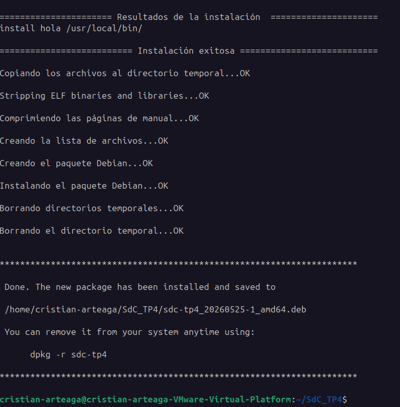

## Acciones para impulsar la seguridad del kernel evitando cargar módulos que no estén firmados (rootkits).
Un *rootkit* es un tipo de software malicioso diseñado para obtener acceso de administrador (root) en un sistema y ocultar su propia existencia. Los rootkits de nivel de kernel son los más peligrosos, ya que operan con los máximos privilegios del sistema operativo, permitiéndoles interceptar llamadas al sistema, ocultar procesos y evadir antivirus tradicionales.

Para mejorar la seguridad del kernel y evitar este tipo de vulnerabilidades, se implementa la firma digital de módulos. Cuando esta política (generalmente respaldada por Secure Boot) está activa, el kernel de Linux se niega a cargar cualquier archivo `.ko` (módulo) que no posea una firma criptográfica válida o cuya firma no provenga de una Autoridad Certificadora (CA) o clave (MOK) pre-aprobada en el firmware de la placa base. Esto asegura que solo el código legítimo y confiable pueda extender las funcionalidades del núcleo, impidiendo que un atacante cargue un rootkit empaquetado como un módulo falso.


---
# Desafío 2

## ¿Qué funcionalidades tiene diponibles un programa y un módulo?
Existe una limitación respecto a qué funciones puede invocar el código dependiendo de dónde se ejecute:

* **Programas (Espacio de usuario):** Tienen a su disposición toda la biblioteca estándar de C (`libc`) y otras bibliotecas de nivel superior. Utilizan funciones como `printf`, `malloc` o `fopen`, las cuales actúan como envoltorios (wrappers) que luego realizan llamadas al sistema seguras hacia el kernel.
* **Módulos (Espacio del kernel):** Al formar parte del núcleo del sistema operativo, no tienen acceso a las bibliotecas del espacio de usuario. Deben utilizar exclusivamente las funciones internas que el propio kernel exporta explícitamente para su uso. Por ejemplo, en lugar de `printf` usan `printk`, y en lugar de `malloc` usan `kmalloc`.

## Espacio de usuario y espacio del kernel
### Espacio de usuario

Es el entorno donde se ejecutan aplicaciones comunes. Los programas no poseen acceso directo al hardware y deben interactuar con el kernel mediante llamadas al sistema.

### Espacio del kernel

Es el entorno donde se ejecuta el núcleo del sistema operativo y los módulos cargados. Posee acceso completo al hardware y a toda la memoria del sistema.

Todos los módulos comparten el mismo espacio de memoria del kernel, por lo que un error puede afectar a todo el sistema operativo.

## Espacio de Datos
El manejo de la memoria es radicalmente distinto entre ambos conceptos:
* **Espacio de Usuario:** Cada programa cuenta con su propio espacio de memoria virtual aislado. Si un programa comete un error crítico (como un puntero nulo), el kernel interviene, termina el proceso (Segmentation Fault) y el resto del sistema sigue funcionando con normalidad.

* **Espacio de Kernel:** Todos los módulos cargados comparten el mismo espacio de direcciones de memoria continuo y sin restricciones. Debido a esto, un error de programación en un módulo (como un puntero salvaje) corrompe la memoria vital del sistema operativo, lo que resulta en un fallo general del sistema (*Kernel Panic*) que obliga a reiniciar la computadora.

## Drivers y contenido de /dev

Se exploró el contenido del directorio `/dev` mediante:

```bash
ls /dev | head
```

Resultado:

```text
autofs
block
bsg
btrfs-control
bus
cdrom
char
console
core
cpu
```

El directorio `/dev` contiene archivos especiales que representan dispositivos físicos y virtuales del sistema.

En Linux, muchos dispositivos se acceden como si fueran archivos.

Ejemplos:

* `/dev/sda` → disco rígido
* `/dev/cdrom` → lectora
* `/dev/null` → dispositivo virtual
* `/dev/random` → generador aleatorio

Los drivers del kernel son los encargados de gestionar estos dispositivos y exponer interfaces accesibles desde espacio de usuario.

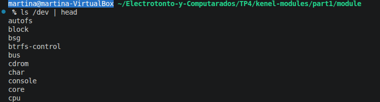
---
### Información de dispositivos del sistema

También se utilizó:

```bash
lsblk
```

Resultado parcial:

```text
sda      79,4G
├─sda1      1M
├─sda2    513M /boot/efi
└─sda3   78,9G /
```

Esto permitió observar:

* discos detectados
* particiones
* puntos de montaje
* dispositivos virtuales utilizados por VirtualBox

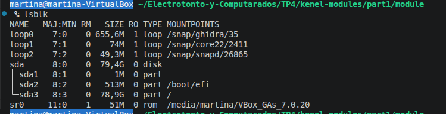


---
# Conclusión

Durante el desarrollo del TP4 se trabajó directamente con módulos del kernel Linux, observando cómo se compilan, cargan y descargan dinámicamente dentro del sistema operativo.

La práctica permitió comprender las diferencias fundamentales entre:

* programas de usuario
* módulos del kernel
* espacio de usuario
* espacio privilegiado del kernel

También se analizaron herramientas importantes del sistema como:

* `lsmod`
* `modinfo`
* `dmesg`
* `/proc/modules`
* `lsblk`

Además, se investigó el rol de Secure Boot y la importancia de las firmas digitales en módulos del kernel para prevenir la carga de código malicioso o rootkits.

Aunque la máquina virtual utilizada no contaba con soporte EFI ni Secure Boot habilitado, la experiencia permitió comprender el funcionamiento general de estos mecanismos de seguridad y su importancia en sistemas modernos.

